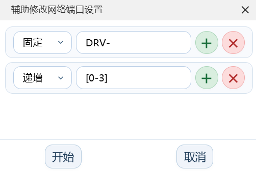
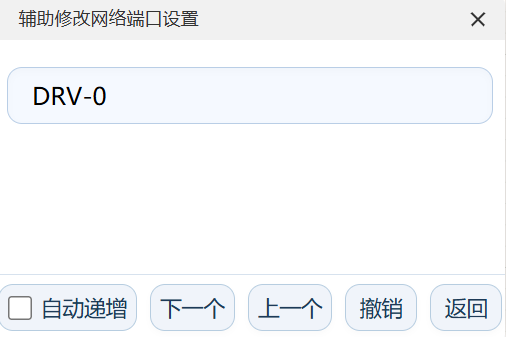

# 网络修改工具

用于辅助修改网络端口，支持点击即修改与动态生成网络名

## 使用方法

插件界面如下：

界面中所有行的内容将按照一定的规则进行拼接为最终的网络名，每行有‘固定’和‘递增’两种模式；

固定模式下输入框内的内容按原样拼接

递增模式下输入框内的内容按指定规则生成序列，与其他行进行拼接，有两种方式生成序列

1. 使用‘,’分割的字符串，如：“a,s,d,f,g,h”；
2. 使用‘[]’包裹且使用‘-~:;’中任意一个作为分割的两个字符，如：[0-9]，[a-z]，[A-Z]；（需注意，字符是有顺序的，前后需按照ASCII表的大小确定，小在前，大在后，附录有ASCII表）

两个方式可以同时使用

生成规则确定后点击‘开始’即可启动辅助更改的功能，界面如下：

‘自动递增’按钮勾选后，在执行一次修改后会自动切换到下一个网络名

## 注意事项

1. 该工具执行的修改可以使用该工具撤销，历史保存上限为20个，返回编辑界面后撤销历史将被清空；
2. 因立创EDA API的原因，对跨页连接标识的的更改此工具无法撤销，更改时需注意

---
# 附录

## ASCII表
| 十进制 | 十六进制 | 字符 | 说明 |
|--------|----------|------|------|
| 0 | 0x00 | NUL | 空字符 |
| 1 | 0x01 | SOH | 标题开始 |
| 2 | 0x02 | STX | 正文开始 |
| 3 | 0x03 | ETX | 正文结束 |
| 4 | 0x04 | EOT | 传输结束 |
| 5 | 0x05 | ENQ | 询问 |
| 6 | 0x06 | ACK | 确认 |
| 7 | 0x07 | BEL | 响铃 |
| 8 | 0x08 | BS | 退格 |
| 9 | 0x09 | HT | 水平制表符 |
| 10 | 0x0A | LF | 换行 |
| 11 | 0x0B | VT | 垂直制表符 |
| 12 | 0x0C | FF | 换页 |
| 13 | 0x0D | CR | 回车 |
| 14 | 0x0E | SO | 移出 |
| 15 | 0x0F | SI | 移入 |
| 16 | 0x10 | DLE | 数据链路转义 |
| 17 | 0x11 | DC1 | 设备控制1 |
| 18 | 0x12 | DC2 | 设备控制2 |
| 19 | 0x13 | DC3 | 设备控制3 |
| 20 | 0x14 | DC4 | 设备控制4 |
| 21 | 0x15 | NAK | 否定确认 |
| 22 | 0x16 | SYN | 同步空闲 |
| 23 | 0x17 | ETB | 传输块结束 |
| 24 | 0x18 | CAN | 取消 |
| 25 | 0x19 | EM | 介质结束 |
| 26 | 0x1A | SUB | 替换 |
| 27 | 0x1B | ESC | 转义 |
| 28 | 0x1C | FS | 文件分隔符 |
| 29 | 0x1D | GS | 组分隔符 |
| 30 | 0x1E | RS | 记录分隔符 |
| 31 | 0x1F | US | 单元分隔符 |
| 32 | 0x20 | (空格) | 空格 |
| 33 | 0x21 | ! | 感叹号 |
| 34 | 0x22 | " | 双引号 |
| 35 | 0x23 | # | 井号 |
| 36 | 0x24 | $ | 美元符号 |
| 37 | 0x25 | % | 百分号 |
| 38 | 0x26 | & | 与符号 |
| 39 | 0x27 | ' | 单引号 |
| 40 | 0x28 | ( | 左括号 |
| 41 | 0x29 | ) | 右括号 |
| 42 | 0x2A | * | 星号 |
| 43 | 0x2B | + | 加号 |
| 44 | 0x2C | , | 逗号 |
| 45 | 0x2D | - | 减号/连字符 |
| 46 | 0x2E | . | 句点 |
| 47 | 0x2F | / | 斜杠 |
| 48 | 0x30 | 0 | 数字0 |
| 49 | 0x31 | 1 | 数字1 |
| 50 | 0x32 | 2 | 数字2 |
| 51 | 0x33 | 3 | 数字3 |
| 52 | 0x34 | 4 | 数字4 |
| 53 | 0x35 | 5 | 数字5 |
| 54 | 0x36 | 6 | 数字6 |
| 55 | 0x37 | 7 | 数字7 |
| 56 | 0x38 | 8 | 数字8 |
| 57 | 0x39 | 9 | 数字9 |
| 58 | 0x3A | : | 冒号 |
| 59 | 0x3B | ; | 分号 |
| 60 | 0x3C | < | 小于号 |
| 61 | 0x3D | = | 等号 |
| 62 | 0x3E | > | 大于号 |
| 63 | 0x3F | ? | 问号 |
| 64 | 0x40 | @ | 艾特符号 |
| 65 | 0x41 | A | 大写A |
| 66 | 0x42 | B | 大写B |
| 67 | 0x43 | C | 大写C |
| 68 | 0x44 | D | 大写D |
| 69 | 0x45 | E | 大写E |
| 70 | 0x46 | F | 大写F |
| 71 | 0x47 | G | 大写G |
| 72 | 0x48 | H | 大写H |
| 73 | 0x49 | I | 大写I |
| 74 | 0x4A | J | 大写J |
| 75 | 0x4B | K | 大写K |
| 76 | 0x4C | L | 大写L |
| 77 | 0x4D | M | 大写M |
| 78 | 0x4E | N | 大写N |
| 79 | 0x4F | O | 大写O |
| 80 | 0x50 | P | 大写P |
| 81 | 0x51 | Q | 大写Q |
| 82 | 0x52 | R | 大写R |
| 83 | 0x53 | S | 大写S |
| 84 | 0x54 | T | 大写T |
| 85 | 0x55 | U | 大写U |
| 86 | 0x56 | V | 大写V |
| 87 | 0x57 | W | 大写W |
| 88 | 0x58 | X | 大写X |
| 89 | 0x59 | Y | 大写Y |
| 90 | 0x5A | Z | 大写Z |
| 91 | 0x5B | [ | 左方括号 |
| 92 | 0x5C | \ | 反斜杠 |
| 93 | 0x5D | ] | 右方括号 |
| 94 | 0x5E | ^ | 脱字符 |
| 95 | 0x5F | _ | 下划线 |
| 96 | 0x60 | ` | 反引号 |
| 97 | 0x61 | a | 小写a |
| 98 | 0x62 | b | 小写b |
| 99 | 0x63 | c | 小写c |
| 100 | 0x64 | d | 小写d |
| 101 | 0x65 | e | 小写e |
| 102 | 0x66 | f | 小写f |
| 103 | 0x67 | g | 小写g |
| 104 | 0x68 | h | 小写h |
| 105 | 0x69 | i | 小写i |
| 106 | 0x6A | j | 小写j |
| 107 | 0x6B | k | 小写k |
| 108 | 0x6C | l | 小写l |
| 109 | 0x6D | m | 小写m |
| 110 | 0x6E | n | 小写n |
| 111 | 0x6F | o | 小写o |
| 112 | 0x70 | p | 小写p |
| 113 | 0x71 | q | 小写q |
| 114 | 0x72 | r | 小写r |
| 115 | 0x73 | s | 小写s |
| 116 | 0x74 | t | 小写t |
| 117 | 0x75 | u | 小写u |
| 118 | 0x76 | v | 小写v |
| 119 | 0x77 | w | 小写w |
| 120 | 0x78 | x | 小写x |
| 121 | 0x79 | y | 小写y |
| 122 | 0x7A | z | 小写z |
| 123 | 0x7B | { | 左花括号 |
| 124 | 0x7C | \| | 竖线 |
| 125 | 0x7D | } | 右花括号 |
| 126 | 0x7E | ~ | 波浪号 |
| 127 | 0x7F | DEL | 删除 |
